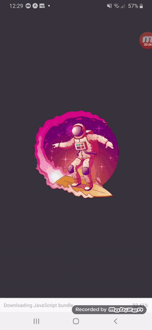
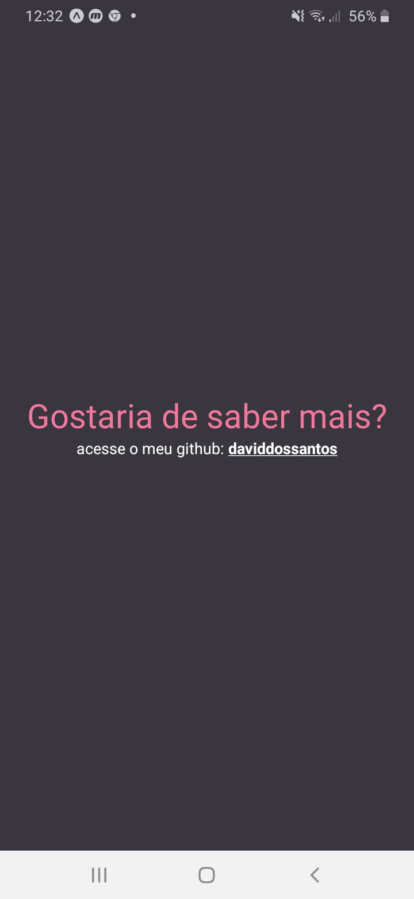
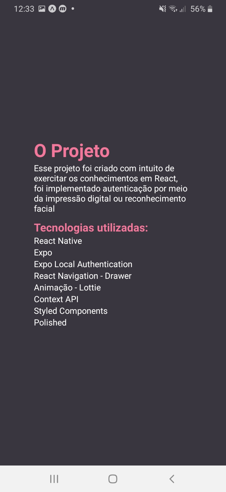
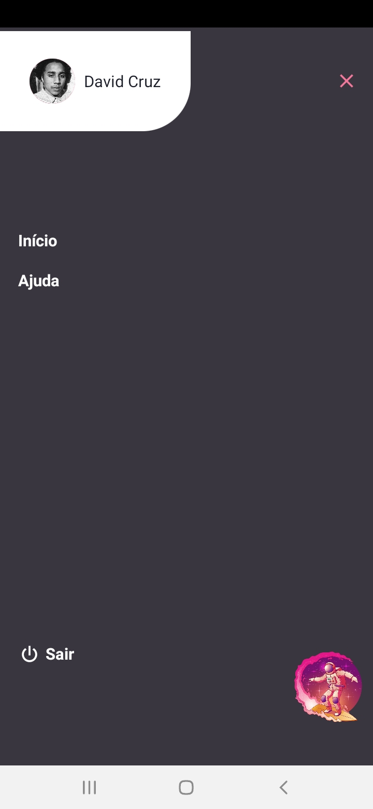

<p align="center">

  <a href="https://www.linkedin.com/in/daviddossantoscruz/">
    
  </a>
  
  
   <a href="https://dc-react-learn.herokuapp.com/">
  
    </a>
</p>

<p align="center">
  <a href="#-rocket-tecnologias">Tecnologias</a>&nbsp;&nbsp;&nbsp;|&nbsp;&nbsp;&nbsp;
  <a href="#-projeto">Projeto</a>&nbsp;&nbsp;&nbsp;|&nbsp;&nbsp;&nbsp;
  <a href="#-como-contribuir">Como contribuir</a>&nbsp;&nbsp;&nbsp;|&nbsp;&nbsp;&nbsp;
  <a href="#memo-licença">Licença</a>
</p>


<div align="center">
  
</div>
<!-- <div align="center">
  
  
  
  
  
</div> -->


## 🚀 Tecnologias

Esse projeto foi desenvolvido com as seguintes tecnologias:

- React Native
- Expo
- Expo Local Authentication
- Styled Components
- Context API
- Animação - Lottie
- React Navigation - Drawer
- Polished
- Async Storage

## 💻 Projeto

Esse projeto foi criado com intuito de exercitar os conhecimentos em React Native, foi implementado autenticação por meio da impressão digital ou reconhecimento facial.

Toda a estilização foi feita usando o Styled Components, já na parte de autentição foi utilizado Context API no compartilhamento de informações.


## 🔨Funcionalidades Implementadas:

<ul>
   <li>Autenticação por meio do reconhecimento facil ou impressão digital</li>
   <li>Splash Screen - utilizando uma animação Lottie</li>
   <li>Menu lateral</li>
 </ul>

## :information_source: Como usar?

Clone e execute a aplicação, você precisa [Git](https://git-scm.com), [Node.js](https://nodejs.org/en/) + [Yarn](https://yarnpkg.com/) instalado no seu computador.

Dentro do seu terminal:

### Instalando Projeto

```bash
# Clone o repositório
$ git clone https://github.com/daviddossantos/galaxy-explorer

# Entre no repositório
$ cd galaxy-explorer

# Instale as depedencias
$ yarn install

# Inicie o projeto
$ expo start

# Lembrando que para utilizar o projeto e precisa instalar o [expo]
```

## 🤔 Como contribuir

- Faça um fork desse repositório;
- Cria uma branch com a sua feature: `git checkout -b minha-feature`;
- Faça commit das suas alterações: `git commit -m 'feat: Minha nova feature'`;
- Faça push para a sua branch: `git push origin minha-feature`.

Depois que o merge da sua pull request for feito, você pode deletar a sua branch.

## :memo: Licença

Esse projeto está sob a licença MIT. Veja o arquivo [LICENSE](LICENSE.md) para mais detalhes.

---

Feito com ♥ by David Cruz :wave: [Entre em contato!](https://www.linkedin.com/in/daviddossantoscruz/)